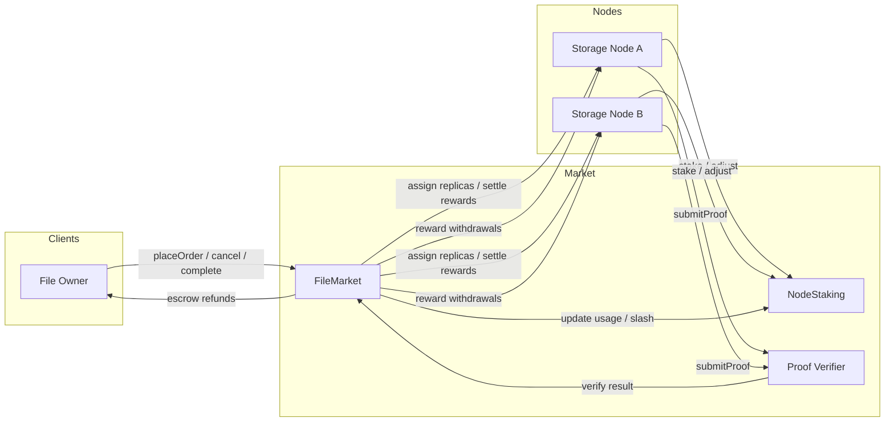

## MuriData Overview

MuriData is a prototype decentralized storage marketplace that pairs a payment/assignment layer (`FileMarket.sol`) with a collateralized staking layer (`NodeStaking.sol`). Clients prepay for storage, nodes stake collateral proportional to the capacity they promise, and a rolling proof-of-integrity heartbeat keeps replicas honest through slashing incentives.

The system is not production ready, but the current implementation demonstrates the full lifecycle of an order, including node participation, reward accrual, challenge handling, and forced exits.

---

## Key Contracts

- `FileMarket.sol` — manages orders, replica assignments, reward settlement, heartbeat challenges, and slashing orchestration.
- `NodeStaking.sol` — tracks node stake, capacity, and usage; exposes slash and capacity adjustment hooks that only `FileMarket` can call.
- `poi_verifier.sol` (imported as `Verifier`) — zk-proof verifier used during challenge rounds to validate integrity proofs.

Both contracts are deployed together; `FileMarket` instantiates `NodeStaking` in its constructor and becomes its sole privileged caller.

---

## Participants

| Actor            | Capabilities                                                                                         |
|------------------|-------------------------------------------------------------------------------------------------------|
| **Clients**      | Create and cancel storage orders, prepay escrow, receive refunds when orders complete.               |
| **Storage nodes**| Stake collateral, accept replica assignments, answer proof challenges, claim accrued rewards.        |
| **Slash authorities** | Addresses approved by `owner` that can trigger manual slashes (e.g. automated monitors).       |
| **Observers**    | Anyone can trigger heartbeats, complete expired orders, or monitor events through the public API.   |

The `owner` of `FileMarket` is expected to be a multi-signature account (e.g. a Safe) that manages slash delegation and other administrative tasks.

---

## Order Lifecycle

1. **Order creation** — A client calls `placeOrder` with file metadata, storage length (`periods`), redundancy (`replicas`), and price per byte-period. The contract calculates the full cost and escrows the payment. The order is added to `activeOrders` for random challenge selection.
2. **Replica assignment** — Staked nodes call `executeOrder` to claim a replica slot if they have free capacity. The node’s `used` bytes are increased and the node/order relationship is recorded.
3. **Serving & accrual** — For each period stored, nodes earn `maxSize * price` (split across replicas). `_settleOrderReward` keeps track of earnings without transferring funds immediately.
4. **Heartbeat challenges** — At most every `STEP` (30 seconds) the system can issue a challenge round. Random orders are chosen; a primary and one secondary prover per order are responsible for submitting zk-proofs of integrity.
5. **Completion / cancellation** — When the storage window ends anyone can call `completeExpiredOrder`. Clients may cancel early via `cancelOrder` (incurs a 10% penalty if replicas were active). In each case `_settleAndReleaseNodes` distributes earned rewards, frees capacity, and refunds the remaining escrow to the client.

---

## Proof & Slashing Workflow

- `triggerHeartbeat` (public) starts a new challenge if the previous one has finished. It seeds randomness and selects up to five active orders.
- `submitProof` validates the prover’s zk-proof using the Merkle root stored in the order and the node’s registered EdDSA key. A primary proof refreshes the randomness seed for the next heartbeat.
- `reportPrimaryFailure` can be called by any valid node once the window expires. It levies a severe slash against the primary prover and seeds fallback randomness.
- `slashSecondaryFailures` runs after the secondary window closes. A reentrancy guard plus the `secondarySlashProcessed` flag prevent double slashing.
- Forced exits (`_handleForcedOrderExits`) settle outstanding rewards and remove the node from all orders whenever a slash forces their capacity below current usage.

---

## Economic Flow

- **Escrow accounting** — Order escrow is reduced only when rewards are settled. `_settleAndReleaseNodes` makes sure node earnings are booked before any client refunds, even during cancellations or forced exits.
- **Reward claims** — Nodes withdraw accrued funds via `claimRewards`. Pending rewards from cancelled/expired orders are tracked per node in `nodePendingRewards` and flushed on claim.
- **Penalties** — Early cancellation with active replicas burns 10% of the remaining escrow. Slashed stake is transferred to the market contract (future versions can redistribute or burn it).
- **Reentrancy protection** — Critical entry points (`placeOrder`, `cancelOrder`, `completeExpiredOrder`, `claimRewards`, `slashNode`, `reportPrimaryFailure`, `slashSecondaryFailures`, `triggerHeartbeat`) all run behind a simple non-reentrancy guard to protect settlement logic.

---

## Running the Suite

```bash
forge install
forge build
forge test --json
```

The JSON output avoids known issues with the local sandbox crashing plain `forge test`. The tests cover:

- Standard order lifecycle (creation, assignment, completion).
- Reward settlement on cancellation, expiry, and slashing events.
- Challenge-system edge cases (primary failure, secondary double-slashed attempt).
- Staking contract fuzzing for capacity changes.

---

## Deployment Notes

- Deploy `FileMarket` from a key you can control initially; immediately call `transferOwnership` to the governance multi-sig (e.g. a Safe on your chosen network).
- Slash authority modules can be registered with `setSlashAuthority`. Restrict this to automated, well-audited agents.
- Proof verifier parameters are instantiated in the constructor. If the circuit or trusted setup changes, the contract must be redeployed.

---

## Roadmap & Caveats

- Governance (multi-sig / module) controls around slashing are still basic.
- The market does not yet redistribute slashed stake or reward reporters.
- Heartbeat randomness is block-derived; integrating a stronger beacon would reduce manipulation risk.
- Production readiness requires additional audits, fuzzing, and cross-layer monitoring.

---

## Architecture Chart


