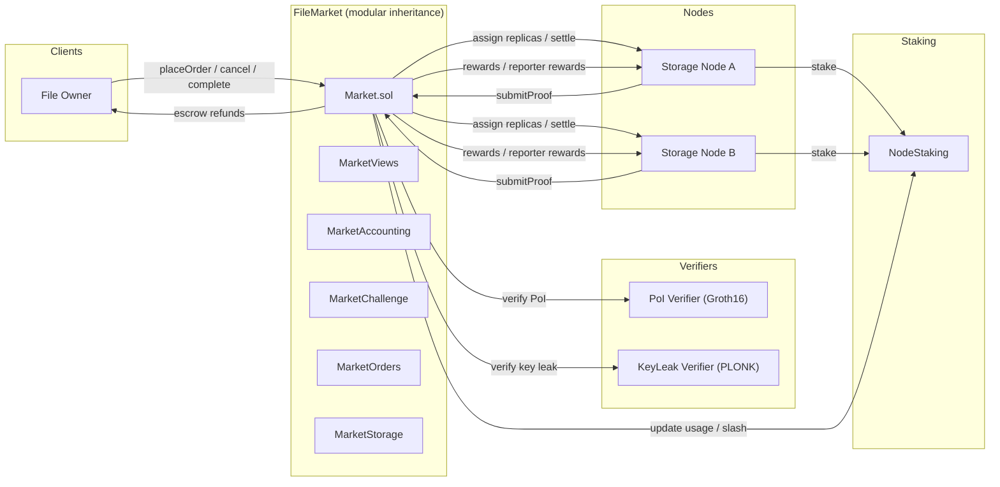

## MuriData Contracts

MuriData is a prototype decentralized storage marketplace that pairs a payment/assignment layer (`FileMarket.sol`) with a collateralized staking layer (`NodeStaking.sol`). Clients prepay for storage, nodes stake collateral proportional to the capacity they promise, and a parallel challenge-slot system verifies storage integrity through Groth16 zk-proofs with on-chain slashing.

The system is not production ready, but the current implementation demonstrates the full lifecycle of an order, including node participation, reward accrual, challenge-based proof verification, and forced exits.

---

## Key Contracts

- **`FileMarket.sol`** (entrypoint via `Market.sol`) — manages orders, replica assignments, reward settlement, parallel challenge slots, key leak reporting, and slashing orchestration. Built as a modular inheritance chain:

  ```
  Market.sol (entrypoint)
    └─ MarketViews.sol (read-only APIs: slot info, dashboard views)
         └─ MarketAccounting.sol (reporter rewards, pull-payment refunds, slash redistribution)
              └─ MarketChallenge.sol (submitProof, processExpiredSlots, activateSlots)
                   └─ MarketOrders.sol (placeOrder, executeOrder, completeExpiredOrder, cancelOrder, quitOrder)
                        └─ MarketAdmin.sol (ownership, slash authority, period/epoch helpers)
                             └─ MarketStorage.sol (shared storage, constants, structs, events)
  ```

- **`NodeStaking.sol`** — tracks node stake, capacity, usage, and ZK public keys; exposes slash and capacity adjustment hooks that only `FileMarket` can call.
- **`poi_verifier.sol`** (imported as `Verifier`) — Groth16 zk-proof verifier used during challenge rounds to validate multi-leaf Proof of Integrity (8 parallel Merkle openings per proof, 4 public inputs: commitment, randomness, publicKey, fileRootHash).
- **`keyleak_verifier.sol`** (imported as `PlonkVerifier`) — PLONK verifier for key leak proofs, enabling full-stake slashing of nodes whose secret key is compromised.

Both `NodeStaking` and verifier contracts are deployed by `FileMarket`'s constructor; `FileMarket` is the sole privileged caller of `NodeStaking` (`onlyMarket` modifier).

---

## Participants

| Actor | Capabilities |
|---|---|
| **Clients** | Create and cancel storage orders, prepay escrow, receive pull-payment refunds when orders complete. |
| **Storage nodes** | Stake collateral, accept replica assignments, submit zk-proofs for challenges, claim accrued rewards. |
| **Reporters** | Call `processExpiredSlots` to slash lazy nodes and earn reporter rewards; call `reportKeyLeak` with a PLONK proof to fully slash compromised nodes. |
| **Slash authorities** | Addresses approved by `owner` that can trigger manual slashes (e.g. automated monitors). |
| **Observers** | Anyone can call `activateSlots`, `processExpiredSlots`, or `completeExpiredOrder` to maintain system health. |

---

## Order Lifecycle

1. **Order creation** — A client calls `placeOrder` with file metadata (including Merkle root), storage length (`periods`), redundancy (`replicas`), and price per byte-period. The contract escrows the full payment and adds the order to `activeOrders`.
2. **Replica assignment** — Staked nodes call `executeOrder` to claim a replica slot (up to `MAX_REPLICAS = 10` per order, `MAX_ORDERS_PER_NODE = 50` per node). Once filled, the order moves to `challengeableOrders`.
3. **Serving & accrual** — For each `PERIOD` (7 days) stored, nodes earn `maxSize * price` per replica. Rewards accrue per (node, order) pair and are tracked without immediate transfer.
4. **Challenge verification** — The parallel challenge-slot system continuously verifies node storage (see below).
5. **Completion / cancellation** — `completeExpiredOrder` distributes rewards and refunds remaining escrow. `cancelOrder` incurs a 10% early-cancellation penalty distributed to assigned nodes. `quitOrder` lets a node voluntarily exit with a `QUIT_SLASH_PERIODS = 3` penalty.

---

## Challenge System (Parallel Slots)

Designed for Avalanche C-Chain where blocks are produced on demand (~2s/block). Uses `block.number` deadlines instead of timestamps.

**N=5 independent challenge slots** run in parallel. Each slot challenges one node to prove one order within `CHALLENGE_WINDOW_BLOCKS = 50` blocks (~100s). Three public entry points:

1. **`submitProof(slotIndex, proof, commitment)`** — The only function nodes call. Sweeps expired slots first (slashing lazy nodes), validates the caller is the challenged node, verifies the Groth16 proof, then advances the slot to a new challenge.
2. **`processExpiredSlots()`** — Maintenance function anyone can call to slash expired slots and earn reporter rewards. Uses `prevrandao` for re-advancing slots.
3. **`activateSlots()`** — Bootstrap/refill idle slots with challengeable orders.

**Timing budget** (documented in `MarketStorage.sol`):
```
50 blocks = ~100 seconds
  Event detection:                    ~2-4s  (1-2 blocks)
  Witness preparation:                <1s    (precomputed SMT + parallel hashing)
  Groth16 proving (CPU):              ~5-10s
  Groth16 proving (GPU/icicle-gnark): ~1-2s
  Transaction submission:             ~4-6s  (2-3 blocks)
  Safety margin:                      ~78-88s
```

**Randomness chain:** Proof commitments (unbiasable ZK nonce) derive randomness for re-advancing slots. Manual `processExpiredSlots` falls back to chain data. Each slot has independent randomness.

**O(1) prover/order checks:** `nodeActiveChallengeCount` and `orderActiveChallengeCount` mappings replace O(N) scans.

---

## Key Management

A node's ZK public key is **permanent** once staked — no rotation is supported. MURI replicas bake the public key into every chunk via `r = H(publicKey, archiveRootHash)`, so rotation would invalidate all replicas.

- **`reportKeyLeak(node, proof)`** — Anyone holding the leaked secret key submits a PLONK proof that `H(sk) == pk`, triggering full-stake slashing + reporter reward. After a full-stake slash the node is removed; there is no recovery path.

---

## Economic Flow

- **Escrow accounting** — Order escrow is reduced only when rewards are settled. `_settleAndReleaseNodes` books node earnings before any client refunds, even during cancellations or forced exits. Incremental aggregates (`aggregateActiveEscrow`, `lifetimeRewardsPaid`) provide O(1) dashboard stats.
- **Reward claims** — Nodes withdraw via `claimRewards`. Pending rewards from removed assignments are tracked in `nodePendingRewards`.
- **Reporter rewards** — Configurable percentage (`reporterRewardBps`, default 10%, max 50%) of slash proceeds goes to the reporter who triggered the slash via `processExpiredSlots` or `reportKeyLeak`. Claimed via `claimReporterRewards`.
- **Pull-payment refunds** — Overpayments and escrow refunds queue to `pendingRefunds` and are claimed via `withdrawRefund`, preventing reentrancy.
- **Penalties** — Early cancellation: 10% of remaining escrow distributed to nodes. Proof failure: value-proportional slash with `MIN_PROOF_FAILURE_SLASH = 0.05 MURI` floor. Forced exit: additional 50% penalty. Slashed stake burned to `address(0)`.
- **Reentrancy protection** — A simple `_locked` flag guards all state-mutating entry points.

---

## Running the Suite

```bash
forge install
forge build
forge test --json        # JSON output avoids local sandbox crash
forge test -vvv          # verbose (used in CI)
forge fmt --check        # check formatting
```

**232 tests across 8 suites:**

| Suite | Tests | Coverage |
|---|---|---|
| `Market.t.sol` | 96 | Order lifecycle, rewards, cancellation, challenge slots, ZK proof integration |
| `NodeStaking.t.sol` | 72 | Staking, capacity, unstaking, fuzz tests, reentrancy |
| `MarketChallenge.t.sol` | 17 | Slot activation, proof submission, expiry, sweep, value-proportional slashing |
| `MarketCore.t.sol` | 11 | Core market functionality |
| `MarketRewardsAccounting.t.sol` | 11 | Rewards tracking and accounting |
| `MarketViews.t.sol` | 11 | View function correctness (slot info, global stats) |
| `MarketKeyLeak.t.sol` | 8 | PLONK proof key leak reporting, full-stake slashing, reporter rewards |
| `MarketFSP.t.sol` | 6 | File size proof verification, order lifecycle with FSP |

---

## Key Constants

| Constant | Value | Description |
|---|---|---|
| `PERIOD` | 7 days | Single billing unit |
| `EPOCH` | 28 days | 4 periods |
| `STAKE_PER_CHUNK` | 10^14 wei | Collateral per chunk of capacity |
| `MAX_REPLICAS` | 10 | Cap replicas per order |
| `MAX_ORDERS_PER_NODE` | 50 | Cap orders per node |
| `NUM_CHALLENGE_SLOTS` | 5 | Parallel challenge slots |
| `CHALLENGE_WINDOW_BLOCKS` | 50 | ~100s proof deadline |
| `MIN_PROOF_FAILURE_SLASH` | 0.05 MURI | Floor for proof-failure slash |
| `QUIT_SLASH_PERIODS` | 3 | Periods charged on voluntary quit |

---

## Deployment Notes

- Deploy `FileMarket` from a key you control; call `transferOwnership` to a governance multi-sig.
- Slash authority modules can be registered with `setSlashAuthority`. Restrict to audited agents.
- Verifier contracts are instantiated in the constructor. If the circuit or trusted setup changes, redeploy.
- `foundry.toml`: optimizer enabled (200 runs), `via_ir = true`. Remappings include `muri-artifacts/=lib/muri-artifacts/`.

---

## Architecture


```mermaid
flowchart LR
    subgraph Clients
        Client[File Owner]
    end
    subgraph Market["FileMarket (modular inheritance)"]
        FM[Market.sol]
        MV[MarketViews]
        MA[MarketAccounting]
        MC[MarketChallenge]
        MO[MarketOrders]
        MS[MarketStorage]
    end
    subgraph Staking
        NS[NodeStaking]
    end
    subgraph Verifiers
        PoI[PoI Verifier &lpar;Groth16&rpar;]
        KL[KeyLeak Verifier &lpar;PLONK&rpar;]
    end
    subgraph Nodes
        NodeA[Storage Node A]
        NodeB[Storage Node B]
    end

    Client -->|placeOrder / cancel / complete| FM
    NodeA -->|stake| NS
    NodeB -->|stake| NS
    FM -->|update usage / slash| NS
    FM -->|assign replicas / settle| NodeA
    FM -->|assign replicas / settle| NodeB
    NodeA -->|submitProof| FM
    NodeB -->|submitProof| FM
    FM -->|verify PoI| PoI
    FM -->|verify key leak| KL
    FM -->|escrow refunds| Client
    FM -->|rewards / reporter rewards| NodeA
    FM -->|rewards / reporter rewards| NodeB
```
